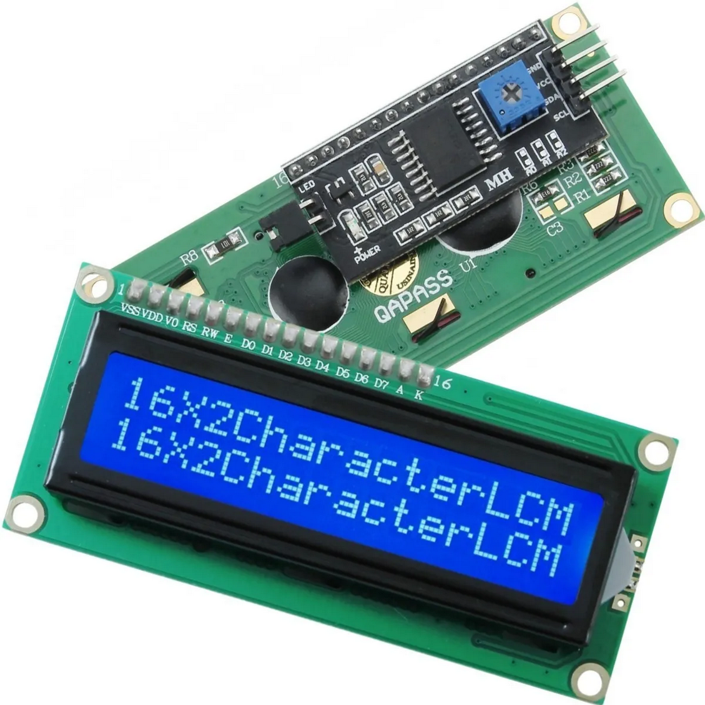

# LCD TCP Server

A Python-based TCP server that communicates with an Arduino via serial and updates an I2C-connected LCD display. This server allows external systems to send simple messages over TCP to be shown on the LCD.

---
For working with LCD1602 + IIC/i2C:

https://www.ebay.com/itm/254801086470




## ✨ Features

- Auto-detects the Arduino using `VID` and `PID`
- Waits for `Ready...` message before sending data
- Reconnects automatically if the Arduino is unplugged
- Accepts TCP messages like `x=0&y=1&message=Hello`
- Displays its device name and TCP port on the LCD at startup
- Includes a systemd service file
- Automatable via Makefile

---

## 🛠 Setup

### 1. Clone this repo

```bash
git clone https://github.com/youruser/lcd-server.git
cd lcd-server
```

### 2. Requirements

Make sure you have Python 3 and `make` installed.

Python dependencies are:

```
pyserial
pyudev
```

They will be installed into a virtual environment.

---

## 🚀 Installation

To install the service and start the TCP server:

```bash
make install
make start
make logs
```

This will:

- Copy the project to `/opt/lcd-server`
- Create a virtual environment
- Install dependencies
- Install and enable the systemd service
- Start the service in the background

---

## 📦 requirements.txt

```txt
pyserial
pyudev
```

---

## 🔧 Configuration

In the systemd unit file (`lcd-server.service`), you can configure:

- USB `VID` and `PID` of your Arduino
- Baud rate (default: 9600)
- TCP port (default: 9999)

You can also override these when launching manually.

---

## 🧪 Usage

To send a message to the LCD from another terminal or system:

```bash
echo "x=0&y=0&message=Hello LCD" | nc 127.0.0.1 9999
```

The format is:

```
x=<column>&y=<row>&message=<text>
```

---

## ⚙️ Run manually (without service)

```bash
python3 lcd_tcp_server.py --vid 2341 --pid 0001 --baud 9600 --tcp 9999
```

Adjust `--vid` and `--pid` depending on your Arduino.

To find them:

```bash
udevadm info -a -n /dev/ttyACM0 | grep id
```

---

## 🧰 Makefile commands

```bash
make install     # Installs the service and server
make start       # Starts the service
make stop        # Stops the service
make restart     # Restarts the service
make logs        # Follows logs
make uninstall   # Removes everything
```

---

## 🧱 Directory structure

```
lcd-server/
├── lcd_tcp_server.py        # Main Python server
├── requirements.txt         # Dependencies
├── lcd-server.service       # systemd service file
├── Makefile                 # For install/start/stop
└── README.md                # You're here
```

---

## ✅ Tested with:

- Arduino Uno (VID: 2341, PID: 0001)
- I2C 16x2 LCD with PCF8574
- Manjaro Linux, Ubuntu Server 22.04

---

## 🔐 Permissions

Make sure your user is in the `dialout` or `tty` group:

```bash
sudo usermod -aG dialout $USER
```

Then reboot or re-login.

---

## 🧼 Uninstall

```bash
make uninstall
```

This removes:

- The systemd service
- All files in `/opt/lcd-server`

---

## 📜 License

MIT License. Free to use, modify and distribute.